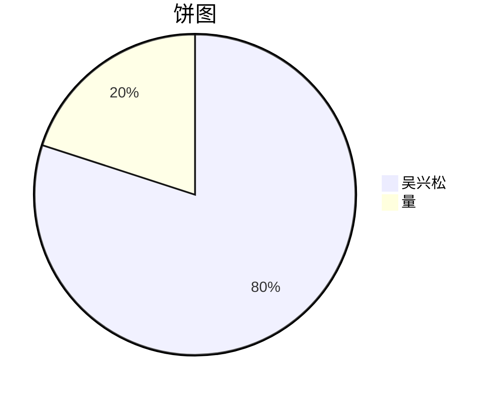

[TOC]

|中|名|3|||||||
|:--|:--:|--:|:--|:--:|:--|:--:|:--|:--:|

*吴兴松*

***吴兴松***

___

***

~~吴兴松~~

<u>吴兴松</u>

吴兴松

吴兴松

$\overline{吴兴松}$

<kbd>吴兴松</kbd>

吴兴松

吴兴松

吴兴松

吴兴松

<table>
    <tr>
    	<th rowspan="4">吴兴松</th>
        <th>吴兴松</th>
        <th>哦</th>
        <th>哦</th>
    </tr>
    <tr>
    	<td>吴兴松</td>
        <td>吴兴松</td>
        <td>吴兴松</td>
    </tr>
        <tr>
    	<td>吴兴松</td>
        <td>吴兴松</td>
        <td>吴兴松</td>
    </tr>
        <tr>
    	<td>吴兴松</td>
        <td>吴兴松</td>
        <td>吴兴松</td>
    </tr>
</table>
