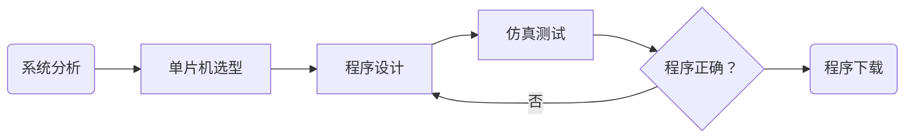

[TOC]

# 单片机开发流程

   单片机应用系统的开发主要包括单片机的外部电路设计和单片机的控制程序设计，其中以单片机的控制程序设计为核心。**一般来说，一个完整的单片机应用系统设计包括系统分析、单片机选型、程序设计、仿真测试并最终下载到实际硬件电路中执行。单片机开发的整个流程如下所示。**

## 系统分析

​    **<u>设计者再开始单片机应用系统开发之前，除了需要掌握单片机的硬件及程序设计方法外，还需要对整个系统进行可行性分析和系统总体方案分析。</u>**这样，可以避免因盲目地工作而浪费宝贵的时间。可行性分析用于明确整个设计任务在现有的技术条件和个人能力上是可行的。
   首先，要保证设计要求可以利用现有的技术来实现。一般可以通过查找相关文献、寻找类似设计等方法找到与该任务相关的设计方案。这样可以参考这些相关的设计，分析该项目是否可行以及如何实现，如果设计的是一个全新的项目，则需要了解该项目的功能需求、体积、和功耗等，同时需要对当前的技术条件和器件性能非常熟悉，以确保合适的器件能够完成所有的功能。 
    其次，需要了解整个项目开发需要的知识是否都具备。如果不具备，则需要估计在现有的知识背景和时间限制下能否掌握并完成整个设计。必要的时候，可以选用成熟的开发板来加快学习和程序设计的速度。 
     当完成可行性分析后，便进入系统总体方案设计阶段。设计者可以参考前面可行细分析中查找到相关资料以及本系统的应用要求和现有技术条件，初步规划本设计所采用的器件以及实现的功能和技术指标。接着，制定合理的时间计划表，编写设计任务书，从而完成系统的总体方案设计。

## 单片机选型

   在单片机应用系统开发中，单片机是整个设计的核心。设计者需要为单片机安排合适的外部器件，同时还需要设计整个控制软件，因此选择合适的单片机型号很重要。<u>目前，市场上的单片机种类繁多，在进行正式的单片机应用系统开发之前，需要根据不同单片机的特性，从中作出合理的选择。</u>

### 单片机选型注意事项

   在单片选型时，主要需要注意以下几点。
   * 仔细调查市场，尽量选用主流的、货源充足的单片机型号，这些器件使用的比较广泛，有许多设计资料供学习或参考。
   * 尽量选择所需的硬件资源集成在单片机内部的型号，例如ADC、DAC、I2C、SPI和USB等。这样便于整个控制系统的软件管理，减少外部硬件的投入，缩小整体电路板的面积，从而减少总体投资等。
   * 对于手持式设备、移动设备或其他需要低功耗的设备、尽量选择低电压、低功耗的单片机型号。这样可以减少能量的消耗，延长设备的使用寿命。
   * 在资金等条件允许的情况下，尽量选择功能丰富、扩展能力强的单片机，这样便于以后的功能升级和扩展。
   * 对于体积有限制的产品，尽量选择贴装的单片机型号，这样可以减少电路板面积，从而减低硬件成本，同时也有助于电磁兼容设计。
> 用户可以根据需要在网上查找最新的单片机型号及参数。

### 程序设计

   <u>当完成系统总体方案并确定单片机型号后，便可以开始电路和程序设计。在进行电路设计时，需要仔细规划整个硬件电路的资源分配以及扩展器件。</u>同时，需要规划哪部分的功能用硬件来实现以及用什么器件来实现，哪部分功能用软件来实现等。这里需要注意以下几点。

   * 如果所选单片机的硬件资源丰富且性能指标达到要求，则应尽量使用其内部集成的硬件资源来实现，这样就可以减少额外的器件投资，同时提高系统的集成度和降低电路的复杂性。
   * 合理规划和使用单片机的硬件资源，充分发挥单片机的性能。
   * 尽量选择一些标准化、模块化的典型电路，这样可以加速电路设计速度，提高设计的灵活性，确保成功率等。
   * 硬件电路上最好将不用的引脚留为扩展的接口，以方便后期的电路维护及硬件升级。
   * 要仔细考虑各部分硬件的功耗以及驱动能力，确保电源具有足够的驱动能力，同时也需要保证相连接的两个器件之间的驱动能力，否则将导致系统无法正常运行。

   在整个单片机应用系统设计中，单片机的程序设计至关重要。在单片机程序设计时，主要需要从以下几点考虑。

   * 选择合适易用的程序开发工具，例如keil系列等。
   * 尽量选择使用单片机C51语言来进行设计，避免使用汇编语言，这样可以使程序易懂，便于代码交流和后期维护。
   * 对于执行速度有特殊要求的场合，可以采用C51语言嵌入汇编代码来实现。
   * 采用结构化的程序设计，将各个主要的功能部件设计为子程序或者子涵数，这样便于调试以及后续的移植修改等。
   * 合理使用单片机的硬件资源，包括RAM、ROM、串口、定时器/计数器和中断等。
   * 程序中尽量采用执行速度快的指令，以充分发挥单片机的运算性能。
   * 充分考虑软件运行时的状态，避免未处理的运行状态。否则，程序运行时进入未处理的状态便容易出错致使软件死机。
   * 必要时可以在软件中采用看门狗定时器来进行强制复位。
   * 编写程序代码时，要尽量添加注释，这样可以提高程序的可读性，便于代码交流和维护。

### 仿真测试

   单片机程序在实际使用前，一般均需要进行代码仿真。单片机仿真测试和程序设计是紧密相关的。在实际设计过程中，通过仿真测试，可以及时发现问题，确保模块及程序的正确性。当发现问题时，需要重新进行修改设计，知道程序通过仿真测试。单片机程序的仿真测试需要从如下几点考虑。
   * 对模块化的程序，可以通过仿真测试单独测试每一个模块的功能是否正确。
   * 对于通信接口，如串口等，可以在仿真程序中测试通信的流程。
   * 通过一个好的程序编译仿真环境，例如keil公司的u Vision系列。英国Labcenter electronics公司的PROTEUS软件等。
   * 如果条件允许，可以选择一款和单片机型号匹配的硬仿真器。硬件仿真器一般支持在线仿真调试，可以实时观察程序中的各个变量，最大程度上对程序进行测试。

