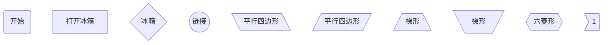

[TOC]

# <font color=red>Markdown基本文本学习</font>

## 标题

\# 标题1

\## 标题2

\***

\###### 标题6

<table><tr><td bgcolor=grey><font color=white>效果：</font></table>

# 标题1

## 标题2

\***

###### 标题6

## 字体加粗、倾斜

\*这是一个斜体*

\**这是一个粗体**

\*** 这是一个粗斜体\***

<table><tr><td bgcolor=grey><font color=white>效果：已添加颜色与字体大小</font></table>

*<font size=5 color=greey>这是一个斜体</font>*

**<font size=5 color=blue>这是一个粗体</font>**

***<font size=5 color=red>这是一个粗斜体</font>***


## 分割线

\* * *

\***

\- - -

\---

<table><tr><td bgcolor=grey>效果：</table>

***

---


\> 这是一个引用

\>> 这是一个引用的引用(这是一个嵌套)

<table><tr><td bgcolor=grey>效果：</table>

> 这是一个引用
>
> > 这是一个引用的引用

\~~这是要被删除的文字~~
<table><tr><td bgcolor=grey><font color=white> 效果：</font></table>

~~这是要删除的文字~~
### 下划线

\<u>这行文字已被添加下划线\</u>

<table><tr><td bgcolor=grey><font color=white>效果：</font></table>

<u>这行文字已被添加下划线</u>

## 列表

### 有序列表

1. 列表1
2. 列表2

1. 列表
   1. 1 嵌套列表
      1. 1.1嵌套列表

### 无序列表

\* 无序列表1

\* 无序列表2

​	\* 无序列表嵌套1

<table><tr><td bgcolor=grey>效果：</table>

* 无序列表1

* 无序列表2

  * 无序列表嵌套1

    \<table><tr><td bgcolor=grey>效果：</table>

## 表格

表头|表头|表头

--|:--:|:--

内容|内容|内容

<table><tr><td bgcolor=grey>效果：</table>

| 表头 | 表头 |
| :---- |:----: |
|内容 |内|

## 代码

普通代码显示 \`代码内容\`

`代码内容`

代码块显示 \```代码\```

```c
#include<stdio.h>
int main()
{
    printf("你好世界")；
    return 0;
}
```

## 换行

* 一句话的后面添加两个空格
* 两行之间添加一个空行
* 让一句话显示两行，在想要换行的地方添加\<br/>

让一句话显示两行，<br/>在想要换行的地方添加\<br/>

### 制作代办事项

\- [ ] 今日代办事项
\- [x] 今日已完成事项

<table><tr><td bgcolor=grey><font color=white>效果</font></table> 

- [ ] 今日代办事项
- [x] 今日已完成事项


### 书写公式

Markdown支持书写公式

两个\$表示整行公式，例如：`$$E=mc^2$$`

<table><tr><td bgcolor=grey><font color=white>效果:</font></table>

$$
E=mc^2
$$

**代码：**

```markdown
$$
\begin{Bmatrix}
	a & b \\
	c & d
\end{Bmatrix}
$$
$$
\begin{CD}
	A @>a>> B \\
@VbVV @AAcA \\
	C @= D
\end{CD}
$$
```

<table><tr><td bgcolor=grey><font color=white>效果:</font></table>

$$
\begin{Bmatrix}
	a & b \\
	c & d
\end{Bmatrix}
$$
$$
\begin{CD}
	A @>a>> B \\
@VbVV @AAcA \\
	C @= D
\end{CD}
$$

### 绘制流程图(graph)

#### 概述

```markdown
graph 方向描述

	图表中的其他语句...
```


关键字graph表示一个流程图的开始，同时需要指定该图的方向。

其中“方向描述"为：

| 用词 | 含义 |
| :---- | :---- |
| TB     | 从上到下 |
| BT|从下到上|
| RL|从右到左|
|LR|从左到右|


#### 节点的画法

代码：

```markdown
graph TB
	A(开始) //这是圆角矩形（表示开始和结束）
	B[打开冰箱]	//矩形（表示过程)
	C{"冰箱"}	//菱形（表示判断/决策)
	D((链接))	//圆形（表示连接。为避免流程过长或有交叉，可将流程切开，圆形即相当于切口处的连接头（成对出现）
	E[\平行四边形\]
	F[/平行四边形/]
	G[/梯形\]
	H[\梯形/]
	I{{六菱形}}
	J>1]
```

效果：



#### 线段的画法

代码：

```markdown
	graph TB
		A[把大象放进去] --> B{"冰箱小不小？"}
		B --> |不小| C[把冰箱门关上]
		B --> |小| D[换个大冰箱]
		
* 上面代码示例中，B{"冰箱小不小？"}这里表示的描述文字加了引号，是因为其中特殊字符（问号）用引号包裹防止出错
* 为节点取名添加ABC不太合适，如果节点很多时往往很容易混淆，不方便后续使用和阅读。建议起有意义的名字
* 除上述带箭头线段-->外，还有带虚线线段-.->、带箭头加粗线段==>、不带箭头线段---
```

效果：


#### 子图表

使用以下语法添加子图表

```markdown
	subgraph 子图表名称
		子图表中的描述语句...
	end
```

```markdown
graph TB
		subgraph 冰箱的大小
	A[把大象放进去] --> B{"冰箱小不小？"}
	end
	B --> |不小| C[把冰箱门关上]
	B --> |小| D[换个大冰箱]
```


### 标准流程图

```markdown
```flow
	st=>start: 开始框
	op=>operation: 处理框
	cond=>condition: 判断框(是或否?)
	subl=>subroutine: 子流程
	io=>inputoutput: 输入输出框
	e=>end: 结束框
	st->op->cond
	cond(yes)->io->e
	cond(no)->subl(right)->op
```


```flow
st=>start: 开始框
op=>operation: 处理框
cond=>condition: 判断框(是或否?)
subl=>subroutine: 子流程
io=>inputoutput: 输入输出框
e=>end: 结束框
st->op->cond
cond(yes)->io->e
cond(no)->subl(right)->op
```

### 标准流程图(横向)

```markdown
```folw
	st=>start: 开始框
	op=>operation: 处理框
	cond=>condition: 判断框(是或否?)
	subl=>subroutine: 子流程
	io=>inputoutput: 输入输出框
	e=>end: 结束框
	st(right)->op(right)->cond
	cond(yes)->io->e
	cond(no)->subl(right)->op
```


```flow
st=>start: 开始框
op=>operation: 处理框
cond=>condition: 判断框(是或否?)
subl=>subroutine: 子流程
io=>inputoutput: 输入输出框
e=>end: 结束框
st(right)->op(right)->cond
cond(yes)->io->e
cond(no)->subl(right)->op
```


### 绘制饼图

语法如下：

```markdown
pie
	title Pie chart
	"Dogs " : 386
	"cats" : 567
	"rabbit" : 700
	"pig" : 365
	"tiger" : 15
```


### 绘制序列图(sequenceDiagram)

<font color=grey>代码：</font>

```markdown
sequenceDiagram
	Title: 买炸鸡
小明->>炸鸡店店员: 还有炸鸡吗?
Note right of Bob: Bob thinks
炸鸡店店员-->>小明: 没有，要现炸!
```


#### 消息线

| 类型 | 描述 |
| ---- | ---- |
| ->|无箭头实线      |
|--> |无箭头虚线|
|->>|有箭头实线（主动发消息)|
|-->>|有箭头虚线（响应）|
|-x|末端为叉的实线（表示异步）|
|--x|末端为叉的虚线（表示异步)|

#### 参与者(participant)

传统时序图概念中参与者角色和类对象之分，但这里我们不做区分，用参与者表示一切参与交互的事物，可以是人、类对象、系统等形式。中间竖直的线段从上至下表示时间的流逝。

```markdown
	sequenceDiagram
		participant 参与者 1
		participant 参与者 2
		...
		participant 简称 as 参与者 3 #该语法可以在接下来的描述中使用简称来代替参与者 3
```

> <font color=red>`participant <参与者名称> `</font>声明参与者，语句次序即为参与者横向排列次序。

#### 处理中-激活框

从消息接收方的时间上标记一小段时间，表示对消息进行处理的时间隔。

在消息的末尾增加<font color=red>`+`</font>，则消息接收者进入当前消息的"处理中"状态；

在消息的末尾增加<font color=red>`-`</font>，则消息接收者离开当前消息的"处理中"状态；

#### 注解（Note）

语法： 

```markdown
	Note 位置表述 参与者：标注文字
```

其中位置表述可以为：

| 表述 | 含义 |
| ---- | ---- |
| right of     |  右侧     |
|left of|左侧|
|over|在当中，可以横跨多个参与者|

```markdown
sequenceDiagram
	participant 1 as 炸鸡店员
	participant 3 as 小红
	participant 2 as 小明
	Note left of 1 :男
	Note right of 3 :女
	Note over 2 :男
	2 ->> 1 :还有炸鸡吗？
	1 -->> 2 :没有，要现炸。
	2 -x +1 :给我炸！
	1 -->> -2 :您的炸鸡好了！
	2 ->> 3 :一起吃炸鸡!
	3 -->> 2 :好的，非常感謝！
	3 -->> 2 :但我要回家了，非常抱歉。
```

```mermaid
sequenceDiagram
	participant 1 as 炸鸡店员
	participant 3 as 小红
	participant 2 as 小明
	Note left of 1 :男
	Note right of 3 :女
	Note over 2 :男
	2 ->> 1 :还有炸鸡吗？
	1 -->> 2 :没有，要现炸。
	2 -x +1 :给我炸！
	1 -->> -2 :您的炸鸡好了！
	2 ->> 3 :一起吃炸鸡!
	3 -->> 2 :好的，非常感謝！
	3 -->> 2 :但我要回家了，非常抱歉。
```

#### 循環(loop)

在條件滿足時，重複發出消息列。（相當于編程語言中的while語句）

```markdown
sequenceDigram
	participant 1 as 炸鸡店员
	participant 3 as 小红
	participant 2 as 小明
	
	2 ->> 1 :还有炸鸡吗？
	1 -->> 2 :没有，要现炸。
	2 -x +1 :给我炸！
	loop 三分鐘一次
		2 -->> 1 :我的炸雞好了沒？
		1 -->> 2 :正在炸
	end
	1 -->> -2 :您的炸鸡好了！
	2 ->> 3 :一起吃炸鸡!
	3 -->> 2 :好的，非常感謝！
	3 -->> 2 :但我要回家了，非常抱歉。
```

```mermaid
sequenceDiagram
	participant 1 as 炸鸡店员
	participant 3 as 小红
	participant 2 as 小明
	
	2 ->> 1 :还有炸鸡吗？
	1 -->> 2 :没有，要现炸。
	2 -x +1 :给我炸！
	loop 三分鐘一次
		2 ->> 1 :我的炸雞好了沒？
		1 -->> 2 :正在炸
	end
	1 ->> -2 :您的炸鸡好了！
	2 ->> 3 :一起吃炸鸡!
	3 -->> 2 :好的，非常感謝！
	3 -->> 2 :但我要回家了，非常抱歉。
```

#### 选择(alt)

在多个条件中作出判断，每个条件对应不同的消息序列。(相当于if及else if语句)

```markdown
sequenceDiagram
	participant seller as 炸鸡店员
	participant AA as 小明
	AA ->> seller :有炸鸡卖吗？
	seller -->> +AA :可卖的炸鸡数
	
	alt 可卖的炸鸡数 > 3
		AA ->> seller :买2只！
	else 0 < 可卖的炸鸡数 < 3
		AA ->> seller :有多少买多少
	else 可卖的炸鸡数 < 0
		AA ->> seller :那我明天再来
	end
	
	seller -->> -AA :欢迎下次光临
```


#### 可选(opt)

在某条件满足时执行消息序列，否则不执行。(相当于单个if语句)

```markdown
sequenceDiagram
	participant AA as 小明
	participant seller as 炸鸡店店员
	AA ->> seller :买炸鸡
	opt 全部卖完了
		seller -->> AA :下次再来
	end
```


#### 并行(Par)

将信息序列分成多个片段，这些片段并行执行。

```markdown
sequenceDiagram
	participant AA as 小明
	participant seller as 炸鸡店店员
	AA ->> seller :一只炸鸡+一杯可乐！
	par 并行执行
		seller ->> seller :装可乐
	and
		seller ->> seller :炸炸鸡
	end
	seller -->> AA :您的炸鸡、可乐，好了!
```


### 绘制甘特图

```markdown
gantt
    dateFormat YYYY-MM-DD-HH
    title 项目开发流程
    section 项目确定
    需求分析:a1,2024-03-07,3d
    可行性报告:after a1,5d
    概念验证:5d
section 项目实施
    概要设计:2024-03-07, 50h
    详细设计:2024-03-09, 10d
    编码:2024 0715,10d
    测试:20240722,5d
section发布验收
    发布:90h
    验收:crit,3d
```


代码分析：

* **<kbd><font face="黑体" color=red>title</font></kbd>**:图名，可选关键字，如没有则不显示
* **<kbd><font color=red>dateFormat</font></kbd>**:自定义时间格式，可省略，默认输入日期格式为`YYYY-MM-DD`，常用的有月日`MM-DD`，日时（24小时制）`DD-HH`
* **<kbd><font color=red>section</font></kbd>**:部分名，例如section项目确定

任务参数，格式如下：

* <font color=red>`任务名：参数一，参数二，参数三，参数四，参数五`</font>
* `参数一`：可选，crit,表示是否强调，如果有会示为红色
* `参数二`：可选，done、active或不填，分别表示**已完成、正在进行中**和**未开始**
* `参数三`：可选，任务别名，des3，主要用于跟在其他任务后面
* `参数四`：任务开始时间，可以为具体的时间，如04-14，或者跟在其他任务后面，例如after des3
* `参数五`: 任务结束时间，可以是具体的时间，如04-07或任务进行的周期，如3d

示例：

项目计划:done,des2,after des1,6d

```mermaid
gantt
    dateFormat YYYY-MM-DD-HH
    title 项目开发流程
    
    section 项目确定
    需求分析:a1,2d
    可行性报告:a2,after a1,2d
    概念验证:a3,after a1,5d
	section 项目实施
    概要设计:a4,after a3,4d
    详细设计:a5,after a4,5d
    编码:a6,after a5,2d
    测试:a7,after a5,5d
	section 发布验收
    发布:90h
    验收:crit,after a7,3d
```

### Html

Markdown支持原生**<font color=red>`HTML`</font>**语法

<font color=grey>代码：</font>

```html
<table>
    <tr>
    	<th rowspan="4">值班人员</th>
        <th>星期一</th>
        <th>星期二 </th>
        <th>星期三</th>
    </tr>
    <tr>
    	<td>李某</td>
        <td>张某</td>
        <td>武某</td>
    </tr>
    <tr>
    	<td>1</td>
    	<td>1</td>
    	<td>1</td>
    </tr>
</table>
```

<table><tr><td bgcolor=grey>效果</table>

<table>
    <tr>
    	<th rowspan="4">值班人员</th>
        <th>星期一</th>
        <th>星期二 </th>
        <th>星期三</th>
    </tr>
    <tr>
    	<td>李某</td>
        <td>张某</td>
        <td>武某</td>
    </tr>
    <tr>
    	<td> 1 </td>
    	<td> 1 </td>
    	<td>1</td>
    </tr>
</table>

代码：

<font size=4 color=ondine>`使用<kbd>Ctrl</kbd>+<kbd>Alt</kbd>+<kbd>Del</kbd>重启电脑`</font>

<table><tr><td bgcolor=grey>效果：</table>

使用<kbd>Ctrl</kbd>+<kbd>Alt</kbd>+<kbd>Del</kbd>重启电脑


### 脚注

这是一个脚注[^1]

# <font color=red>Markdown文本进阶学习</font>

## 更改字体、大小、颜色

\<font(修改字体) face="字体型号" size=30(字体的大小) color=#008000(颜色)>颜色</font>

```markdown
<font size=30 color=#008000>颜色</font>
```

<font size=30 color=#008000>颜色</font>

```markdown
<font size=30 color=red>颜色</font>
```

<font size=30 color=red>颜色</font>

```markdown
<font size=30 color=Blue>颜色</font>
```

<font size=30 color=Blue>颜色</font>

```markdown
<font size=12 >字体大小</font>
```

<font size=12 >字体大小</font>

```markdown
<font size=30 color=gree>颜色</font>
```

<font size=30 color=gree>颜色</font>

<font size=5 face="微软雅黑">微软雅黑</font>

### 背景色

\<table><tr><td bgcolor=yellow>背景色yellow</table>

<table><tr><td bgcolor=yellow>背景色yellow</table>

### 设置文字居中

\<center>居中</center>

<center>居中</center>

\<p align="left">左对齐</p>

<p align="left">左对齐</p>

\<p align="right">右对齐</p>  

<p align="right">右对齐</p>  

### 下标

```markdown
CO<sub>2</sub>
```

CO<sub>2</sub>

### 上标

```markdown
爆米<sup>TM</sup>
```

爆米<sup>TM</sup>

# <font face="楷体" color=red>Markdown进阶使用</font>

## 超链接

> 要建立一个行内式的链接，只要在方块括号后面紧接着圆括号并插入网址链接即可，如果还想要加上链接的title文字，只要在网址后面，用双引号把title文字包起来即可。

<table><tr><td bgcolor=greey>示例：</table>

```markdown
[这是一个链接](https://github.com/2774326573/my-vim.git "https://github.com/2774326573/my-vim.git")
```

<table><tr><td bgcolor=grey><font color=white>效果：</font></table>

[这是一个链接](https://github.com/2774326573/my-vim.git "https://github.com/2774326573/my-vim.git")

## 自动链接

```markdown
<https://github.com/2774326573/my-vim.git>
```

<table><tr><td bgcolor=grey><font color=white>效果：</font></table>

<https://github.com/2774326573/my-vim.git>

## 图片

```markdown

```


[LaTex格式]Markdown或者LaTeX在单个字母上加一横、一点、两点、三角

| 符号              | 语法 |
| ----------------- | ---- |
| 字母上三角$\hat{H}$ | \$\hat{H}$ |
|字母上大三角$\widehat{H}$|\$\widehat{H}$|
|字母上横$\overline{H}$|\$\overline{H}$|
|一阶导，字母上一点$\dot{H}$|\$\dot{H}$|
|二阶导，字母上两点$\ddot{H}$|\$\ddot{H}$|
|向量，字母上箭头$\vec{H}$|\$\vec{H}$|
|鄂化符号 等价无穷小$\widetilde{a}$|\$\widetilde{a}$|

[^1]: 这是一个脚注

